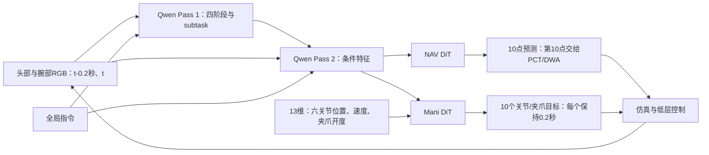

# 当前模型架构与闭环失败分析

分析基于 2026-09-05 正式运行，公开整理时的最新总体快照见[实验卡](experiments/formal_5hz_20260905.md)。

固定模型step_002414。依据为完整validation、正式闭环实例liangzhunew500-000005的已保存轨迹和实际模型构建代码。本分析不修改正在执行的冻结test协议，也不把单个实例的失败推广为所有场景的因果结论。

## 核心判断

优先排查导航到抓取的交接、任务状态可观测性和动作执行反馈周期。现有证据不足以把主要原因归结为Qwen或DiT参数规模不足。

关键新增证据来自source_assisted、diffusion seed43的失败轨迹：96次请求耗尽；84条响应的committed_route为PICK，其中包含未执行Pass 2的等待请求，实际统计了750个操作关节目标。每个目标最后可见控制tick的六关节平均跟踪误差为0.000948 rad，夹爪开度跟踪MAE为0.002352。PICK期间TCP到物体最近距离仍为0.2074m，测得夹爪闭合时最近为0.2241m，物体peak_lift为0。这说明该案例中低层关节跟踪总体正常，而生成并执行的动作没有把TCP带到物体附近。

第一次切入PICK时，底座相对源task中名义pick.base_goal的XY差为0.1807m、yaw差为0.6776rad（约38.8°）。名义示范站位不是唯一可行站位；这个差异只作为交接与分布偏移诊断，不能直接当作所有抓取姿态的合格线。原始证据及计算结果见训练运行目录下的 `evaluation/architecture_tracking_diagnostic_seed43.json`（原始轨迹不随 Git 分发）。

## 实际信息流

模型通过训练入口scripts/train_joint_trajectory.py::_build_model实际构建两套M0DiTActionHead。最终配置为4次FM采样迭代；joint_trajectory_model.py中另一个旧ExpertConfig的10步默认值不是本次模型实际配置。num_target_vision_tokens=32在此实现中用于learnable future_tokens，并非把Qwen视觉特征压缩为32个token。

## 按优先级分析

### 1. 导航与抓取交接缺少任务几何确认

NAV负责底座，Mani负责六关节和夹爪；Mani阶段底座速度固定为零，当前两种物理条件还会锁定底座位置。RouteCommitter依据两次新观测的阶段概率提交切换，没有检查当前站位是否支持接下来的抓取。Mani输入没有显式底座姿态、TCP/物体相对位姿或可达性描述。

因此，一旦视觉路由在尚未充分对齐时切入PICK，后续动作可能在偏离示范站位的条件下重复伸手；底座不会由Mani动作做小范围修正。上述18cm、约39°站位差和始终大于20cm的TCP距离支持优先检查这条路径，但不能独立证明它是唯一原因。

候选改进：学习抓取就绪度/相对几何；明确粗导航、精对齐与操作的交接；为操作头提供部署可用的底座姿态和相对目标估计。应先用相同策略在源名义抓取站位启动的validation诊断，区分站位问题与动作头问题。中间阶段启动成绩单独报告。

### 2. 阶段分类缺少显式任务状态与持续记忆

JointTrajectoryQwenInterface只选video、lang及本次assistant prefix；13维mani_state不进入Qwen。每次只用两个时间点的图像，没有把此前动作、此前是否抓住、当前失败次数等任务历史作为模型输入。RouteCommitter有有限状态用于两次确认，但这不是模型内部的任务状态估计器。

源码里有progress head，但本数据physical_progress_valid全为false，lambda_progress=0，且进度头不参与当前推理切换。RECOVER主要表现为异常或未确认时hold，不是从失败数据训练出的恢复技能。

实测全validation路由准确率98.59%，边界窗口只有91.73%（95% CI 90.20%–93.14%），内部窗口约99.87%。闭环还出现未抓起而切换PLACE/NAV_TO_TARGET。总体分类准确率不足以证明物理阶段切换正确。

候选改进：加入短任务历史和动作结果特征，学习grasped/carrying/released/stalled等可观测状态与不确定性，让阶段切换依赖任务证据。证据必须来自部署可用传感器或训练过的状态估计，不能直接使用评估器的仿真真值。当前没有可靠progress标签，简单提高lambda_progress不能补上这部分监督。

### 3. 视觉决策周期与精细操作需求不匹配

_execute_manipulation会将10个目标各执行10个50Hz tick，总共2.0秒，然后才重新查询模型。低层关节伺服有反馈，但动作块内部没有由新视觉或接触结果触发的策略重规划。5Hz是观测采样/目标点率；完整操作块期间模型重规划频率约0.5Hz。

若第一段接近动作产生位置误差，剩余闭合、抬升目标仍按最初观测生成的动作块执行。短视觉历史与长执行块组合值得验证。

候选诊断：固定10点预测，在独立validation协议中比较执行前1/2/10点后重新观测，或使用事件触发中断。当前formal协议禁用prefix，修改执行点数属于新协议，不能与正在运行的正式成绩混合。该对照用于辨别反馈周期贡献，不能先验保证提高成功率。

### 4. 动作输出与物理边界没有在学习端闭合

M0DiTActionHead最终为MLP输出，经FM采样后直接返回，夹爪通道没有有界输出层。夹爪在反归一化后由执行器裁剪至[0,1]，关节位置和速率也在执行阶段裁剪。当前训练目标包含语言、路由、FM动作和阶段边界排序，没有显式TCP接近目标、接触成功或执行器裁剪一致性目标。

Validation模型裁剪事件率10.99%，夹爪预测点中50.47%越界，正越界幅度中位数0.0117，最大0.15625。给真实route/subtask的oracle诊断仍有约11.07%裁剪率，因此输出边界问题不能全部归结为路由错误；oracle与predicted覆盖和噪声不同，不能据此断言oracle动作更差。

候选改进：保持关节动作输出，评估有界夹爪参数化、边界约束和基于正运动学的末端几何监督；分别检查原始输出与执行器实际目标。仅改裁剪不能解决TCP仍距物体20cm的问题。原0.5%门槛保持。真实标签本身也有0.8201%执行器事件率，需要独立解决标签/执行合约不一致。

### 5. 成功示范训练缺少失败状态修正覆盖

数据发布要求源episode成功，并含固定顺序的四阶段。动作训练使用真实route和canonical solution条件；部署使用模型自产route/subtask。现有配置禁用on-policy correction和image augmentation。阶段边界排序、夹爪切换采样已经存在，但它们监督的是成功示范中的局部行为，不能替代失败后如何重新对齐/重新抓取的示例。

闭环第一次偏离成功示范后，模型可能进入训练中缺少的站位、视角和抓取失败状态。独立采样的动作块也没有显式接续上一个未执行计划。

候选改进：先收集当前策略在validation条件下产生的失败状态，提供修正动作与可观测失败标签；针对站位、视角、光照等扰动验证鲁棒性。不能根据test结果反复改模型再把同一test当独立最终成绩。

### 6. 导航预测与规划接口存在表示转换

训练NAV预测源底座未来10个实际位姿点。执行器保留10点供记录，但PCT的实际API只使用第10点目标，DWA跟踪PCT返回的路径；模型前9点不是PCT必须经过的约束点。规划器返回路线的形状和终点可能与模型预测不同。

当前有两次失败的终点偏差仅比0.10m门槛多0.35/0.55mm，另一次为0.1253m。应检查地图离散、坐标变换、终点处理和局部站位影响，不能直接把每次规划退出都解释为VLM错误。

候选改进：在validation中单独验证源/模型目标经当前PCT接口后的偏差，明确模型输出要表达的是局部目标还是需跟踪的整条轨迹，再决定训练/执行接口调整。

## 排查顺序

1. 同条件执行源绝对动作目标，检查源5Hz采样经过当前5.1迁移与50Hz保持控制后是否还能完成抓取。这是环境/执行一致性诊断。
2. 在源名义抓取站位启动相同模型，检查站位变化能否消除TCP长期够不到物体的现象。这是交接诊断。
3. 对照完整2秒动作块与更频繁视觉重规划；同时记录请求时刻、实际目标、实测关节、TCP/物体距离。
4. 对照不同输入状态/历史及夹爪边界参数化，明确哪项改善阶段判断、哪项改善抓取几何、哪项仅改善数值指标。
5. 据上述结果决定是否补失败修正数据、增加状态估计/几何监督，最后再评估更换或增大backbone的必要性。

源Sim6与当前Sim5.1的视觉和物理差异始终是混杂因素。上述新对照均应放在独立validation协议中，保留完整任务主成绩与诊断成绩的区别。

## 代码依据

- `src/conveyor_bench/conveyorvla/joint_trajectory_model.py`：输入筛选、两阶段推理、oracle_loss。
- `src/conveyor_bench/conveyorvla/joint_trajectory_runtime.py`：RouteCommitter、关节/夹爪裁剪与恢复hold。
- `src/conveyor_bench/conveyorvla/joint_trajectory_system.py`：PCT endpoint-only接口和完整操作块执行。
- `src/conveyor_bench/conveyorvla/dit.py`：实际M0动作头、future tokens、无界采样输出。
- `src/conveyor_bench/conveyorvla/joint_trajectory_data.py`：成功episode约束、示范阶段、相对关节目标、缺失progress监督。
- `configs/manipulation_navi_v1.json`及`scripts/train_joint_trajectory.py::_build_model`：最终生效配置和构建路径。
