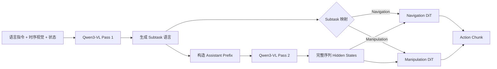

# ConveyorVLA AL0：StarVLA 式双前向 Subtask 与 Seen 任务训练计划

> 状态：实施中
> 更新时间：2026-08-15
> 本文替代“外部 Phase Router + 冻结 VLM”的旧模型计划；原始数据与既有 checkpoint 保持只读。

## 1. 新版 Goal

将 ConveyorVLA AL0 从当前的：

```text
冻结 Qwen3-VL
  → 外部 Phase Router 分类
  → 选择 Navigation / Manipulation DiT
```

修改为：

```text
Qwen3-VL 第一次前向生成可见的 subtask 语言
  → 根据 subtask 确定动作域
  → 将预测出的 assistant prefix 放回完整对话
  → Qwen3-VL 第二次完整前向取得 hidden states
  → 进入对应的 Navigation / Manipulation DiT
  → 输出连续 action chunk
```

同时满足三个原则：

1. 保留现有两个独立 DiT 的结构、动作维度和 action horizon；
2. Qwen3-VL-4B 主干进行全参数微调，不再冻结，也不使用 LoRA 代替全量训练；
3. 第一轮训练以 Liangzhu n200/n250 的 seen 任务为主体，先把已见场景中的完整能力跑通，再讨论 unseen 泛化。

## 2. 审计基线

### 2.1 当前 ConveyorVLA 的真实状态

| 项目 | 当前实现 | 与新目标的差距 |
|---|---|---|
| 子任务预测 | `PhaseRouter` 对 Qwen hidden 做四分类 | 子任务不是由 VLM 生成的语言 |
| VLM 前向 | 一次前向后直接进入 Router 或 DiT | 缺少“先生成 subtask，再带 prefix 重跑”的第二次前向 |
| VLM 训练 | `qwen.requires_grad_(False)`，并调用 `freeze_qwen()` | 与全量微调要求相反 |
| 动作模型 | Navigation 2 维、Manipulation 7 维两个独立 DiT | 该部分保留 |
| 数据标签 | `phase_id`、`phase_instruction`、`action_domain` | 缺少 assistant `subtask_text`、完整 prefix 与 subtask history |
| 训练入口 | 单卡、Router/Nav/Manip 三个组件分开训练 | 不能进行共享 VLM 的端到端联合训练 |
| 在线返回 | 只返回 10 维动作块 | 无法观察预测 subtask、路由依据和两次前向延迟 |
| checkpoint | 每阶段只保存一个 trainable module | 无法完整恢复全量微调后的 VLM 与双 DiT |

### 2.2 StarVLA 参考基线

本地只读参考仓库：

```text
/home/lemon/research/Issac/starvla_base
branch: feature/wallx-unified-router-prompt
commit: a91b444548214f65d2020d888f7ff55622e35477
license: MIT
```

重点检查的实现包括：

- `QwenPI.predict_route()`：第一次 Qwen 推理并生成 route/subtask；
- `QwenPI.predict_action_with_route_token()`：把生成的 assistant prefix 放回输入并再次取得 hidden states；
- `train_starvla_subtask.py`：teacher-forcing、显式训练循环、Accelerate/DeepSpeed、checkpoint 和日志；
- `serve_wallx_router_policy.py`：解析 subtask、执行第二次前向并返回动作；
- `eval_router_offline_wallx.py`：批量与逐帧调试；
- `serve_wallx_router_policy_repeat.py`：相同输入的重复推理一致性检查。

需要注意：StarVLA 当前 subtask 专用配置冻结 action model，并对送入 action loss 的 hidden states 执行 `detach()`。这适合单独训练语言 subtask，但不等于本项目要求的全量联合微调，因此只参考其流程，不照搬这一训练选择。

## 3. 目标模型链路



两个 Pass 共享同一套 Qwen3-VL 参数，不是两个 VLM。第一次负责产生人类可读的任务语言，第二次让动作模型看到与该语言一致的完整多模态上下文。

## 4. Subtask 输出合同

### 4.1 第一轮输出格式

沿用 StarVLA 的 assistant prefix 思路：

```text
<|pred_action|><|subtask|>Pick up the Coke can, lift it, and retract the arm.<|end_subtask|>
```

特殊 Token 只负责界定答案范围。真正的子任务内容是自然语言，而不是外部 MLP 输出的阶段编号。

### 4.2 Seen 任务的受控语言集合

第一轮先使用四条受控自然语言，避免自由生成同义句导致路由解析不稳定：

| Phase | VLM 需要生成的 canonical subtask language | 动作域 |
|---|---|---|
| `NAV_TO_SOURCE` | `Walk to the box holding the Coke can.` | Navigation |
| `PICK` | `Pick up the Coke can, lift it, and retract the arm.` | Manipulation |
| `NAV_TO_TARGET` | `Turn around and walk to the empty box.` | Navigation |
| `PLACE` | `Lower the Coke can onto the empty box and release it.` | Manipulation |

最终文本必须在 raw 数据审计后与 n200/n250 的真实放置语义一致，再冻结到数据 manifest。模型仍然执行自回归语言生成，但解码范围限制在上述 canonical 句子组成的前缀树中。

### 4.3 不再独立预测 Agent

`agent` 不再作为第二个学习标签。动作域由 subtask 确定性得到：

```text
NAV_TO_SOURCE / NAV_TO_TARGET → Navigation DiT
PICK / PLACE                 → Manipulation DiT
```

对外结果仍显示 `action_domain`，但它是解析结果，不是与 subtask 可能互相矛盾的独立预测。

建议的第一轮返回对象为：

```json
{
  "subtask_text": "Pick up the Coke can, lift it, and retract the arm.",
  "phase": "PICK",
  "action_domain": "MANIPULATION",
  "assistant_prefix": "<|pred_action|><|subtask|>Pick up the Coke can, lift it, and retract the arm.<|end_subtask|>",
  "parse_ok": true
}
```

### 4.4 DONE 的处理

当前 PCT raw 只提供四个可执行阶段，没有可靠的 terminal VLM 监督。因此本轮不伪造 `DONE` 语言样本，也不把 `DONE` 送入任何 DiT。只有数据审计确认存在放置完成后的有效观测窗口时，才增加独立的终止输出合同。

## 5. 两次 Qwen 前向的精确定义

### 5.1 Pass 1：Subtask generation

输入：

```text
system prompt
+ 全局任务指令
+ head 短时序视觉
+ wrist 短时序视觉
+ 已完成 subtask history
+ “What subtask should the robot perform now?”
```

输出：

```text
<|pred_action|><|subtask|>{subtask_text}<|end_subtask|>
```

在线推理使用 greedy autoregressive generation，并在 `<|end_subtask|>` 处停止。训练时对完整 assistant answer span 计算语言 CE。

### 5.2 Pass 2：Action conditioning

第二次输入复用相同图像和 user prompt，并附加第一轮得到的 assistant prefix：

```text
images + user prompt
+ assistant:
<|pred_action|><|subtask|>{subtask_text}<|end_subtask|>
```

随后重新执行一次完整 Qwen3-VL forward：

```python
output_hidden_states=True
use_cache=False
```

当前 ConveyorVLA DiT 继续读取第二次前向最后一层的完整 Token 序列：

```text
[batch, sequence_length, 2560]
```

StarVLA 的 LayerwiseFM head 会读取最后若干层，但替换为该 head 会改变现有双 DiT 架构。本轮严格保留当前 M0/ConveyorVLA DiT，因此只改变 hidden states 的来源，不改变 DiT 内部结构。

### 5.3 训练与推理对齐

训练初期：

```text
Pass 1：用 GT subtask 做 teacher-forced CE
Pass 2：使用 GT assistant prefix 取得 hidden states 并训练对应 DiT
```

在线推理：

```text
Pass 1：实际生成 predicted subtask
Pass 2：使用 predicted assistant prefix 取得 hidden states并调用对应 DiT
```

这会产生正常的 teacher-forcing gap。处理方式不是从第一步就让每个训练 batch 做不可微的生成，而是在模型稳定后混入 predicted-prefix 样本：

1. 先完成 GT-prefix warmup；
2. 周期性离线生成训练集 subtask；
3. 将预测正确和预测错误的 prefix 均写入只读 cache；
4. 联合阶段逐步将 predicted-prefix 比例从 0 提升到 20%；
5. 单独报告 GT-prefix 与 predicted-prefix 的动作性能差距。

## 6. 全量微调合同

### 6.1 Trainable 参数

以下 Qwen3-VL 组件全部设置为 `requires_grad=True`：

- vision encoder；
- multimodal projector/merger；
- language model 全部 Transformer block；
- input/output embedding；
- LM head；
- 新增的 subtask delimiter Token embedding。

同时训练：

- Navigation DiT；
- Manipulation DiT；
- 两个动作域各自的输入/输出边界层。

不再保留 `freeze_qwen()` 调用，不使用 LoRA，也不把 action hidden states `detach()`。

### 6.2 损失函数

第一轮语言损失：

\[
\mathcal{L}_{subtask}
= \operatorname{CE}(\hat y_{assistant}, y_{assistant})
\]

第二轮动作损失：

\[
\mathcal{L}_{action}
=
\begin{cases}
\mathcal{L}_{nav}, & z \in \{NAV\_TO\_SOURCE, NAV\_TO\_TARGET\} \\
\mathcal{L}_{manip}, & z \in \{PICK, PLACE\}
\end{cases}
\]

总损失：

\[
\mathcal{L}
= \lambda_{subtask}\mathcal{L}_{subtask}
+ \lambda_{action}\mathcal{L}_{action}
\]

两个损失都允许向 Qwen3-VL 反向传播。这样“全量微调”不仅表示参数没有被冻结，也表示动作目标能够调整第二轮使用的视觉语言表征。

### 6.3 显存控制

同一个 micro-step 内顺序执行两次 forward/backward：

1. Pass 1 forward → subtask CE backward → 释放第一张计算图；
2. Pass 2 forward → selected DiT action loss backward → 释放第二张计算图；
3. 达到 gradient accumulation 数量后统一 optimizer step。

这样不需要同时保留两张 Qwen 计算图。训练仍启用：

- BF16；
- FlashAttention 2；
- gradient checkpointing；
- DeepSpeed ZeRO-3；
- gradient clipping；
- sharded optimizer state。

### 6.4 初始优化器建议

| 参数组 | 初始学习率 |
|---|---:|
| Qwen3-VL vision/language backbone | `2e-6` |
| LM head、新增 Token embedding | `1e-5` |
| 两个 DiT trunk | `2e-5` |
| 动作域重新初始化的输入/输出边界 | `1e-4` |

这些是 smoke 起点，不是未经测量就冻结的最终超参数。100-step benchmark 后根据梯度范数、显存、吞吐和 seen validation loss 再确定正式配置。

## 7. Seen 数据处理计划

### 7.1 Seen 的定义

本轮 `seen` 表示与训练分布一致的任务：

- Liangzhu 同一场景与相机合同；
- Go2-X5 同一机器人状态与动作合同；
- 可乐罐从有物体的箱子移动到空箱子的同一任务语义；
- 四个已知 subtask；
- n200/n250 中通过物理和数据完整性门禁的 episode。

它不等于“当前画面中一定能看见目标”。目标暂时离开视野时，模型仍可利用完整指令、时序视觉和 subtask history 判断当前任务。

### 7.2 原始数据保持不变

n200/n250 raw 与已经转换的 LeRobot v3 视频不就地改写。新增一个 sidecar view，按 `base_index` 关联现有 H.264/PyAV 数据，从而避免复制 MP4。

新 sidecar 每个样本至少包含：

```text
source_collection
source_episode_id
base_index
dataset_scope = seen
split
phase_id
phase_name
subtask_text
assistant_solution
subtask_history
action_domain
phase_pure_action_horizon
```

其中：

```text
assistant_solution =
<|pred_action|><|subtask|>{subtask_text}<|end_subtask|>
```

### 7.3 必做审计

转换前必须得到以下报告：

1. n200/n250 的 episode、query 和四阶段数量；
2. 物理成功、相机同步、state28、20-step action 和 phase-pure 门禁结果；
3. 两个来源之间的 episode ID、文件哈希和近重复轨迹检查；
4. 每个 episode 的阶段覆盖与阶段边界；
5. source/target 语义是否与 canonical subtask 文本一致；
6. 每个视频 feature 的首帧与抽样中间帧 PyAV 解码；
7. 数据转换 manifest、源哈希与排除原因。

任务失败但结构完整的数据只进入诊断集，不进入第一轮行为克隆。无法可靠重建 phase 或 action horizon 的数据不得靠猜测补标签。

### 7.4 Split

seen 数据按 episode 隔离，并对 n200/n250 来源分层：

```text
seen_train: 90%
seen_val:    5%
seen_test:   5%
```

使用固定 seed 的哈希分配，并冻结 episode 清单与 SHA-256。相邻帧、同一 episode 或确认重复的轨迹不能跨 split。

### 7.5 采样策略

- VLM subtask CE 对四个 subtask 做平衡采样；
- Navigation 与 Manipulation 动作 batch 分开统计；
- 两类 Navigation、两类 Manipulation 在各自动作域内继续平衡；
- 所有 action-loss batch 来自 `seen_train`；
- 主训练流的 90%—100% 为 seen 数据；若有许可和格式都明确的通用 VLM/VQA replay，可最多加入 10% 以减轻全量微调遗忘，但不影响 seen action loss。

unseen 任务不参与本轮 optimizer 更新，只保留为后续泛化评测。

## 8. 双 DiT 保持不变的范围

### Navigation DiT

```text
input:  Pass 2 hidden states + state28 + diffusion timestep
output: 20 × 2 [vx, wz]
```

### Manipulation DiT

```text
input:  Pass 2 hidden states + state28 + diffusion timestep
output: 20 × 7 [TCP relative pose 6D + gripper]
```

以下内容不变：

- DiT block 数量、hidden size、attention 结构；
- flow-matching/noise schedule；
- 20-step horizon；
- Navigation/Manipulation 的动作归一化；
- 现有 ABot/ConveyorVLA action trunk 权重迁移合同。

本轮只改变：

- hidden states 来自带 subtask assistant prefix 的第二次 Qwen 前向；
- 当前调用哪个 DiT 由生成的 subtask 决定；
- Qwen 与所选 DiT 进行联合反向传播。

## 9. 训练与调试逻辑

### 9.1 训练器

参考 StarVLA 的显式 PyTorch + Accelerate + DeepSpeed 循环，改造现有 `train_hierarchical.py`，不复制一套长期并存的版本目录。

训练器必须：

- 明确执行 Pass 1 CE 和 Pass 2 action loss；
- 在同一优化周期内按 Navigation/Manipulation 同步调度 batch；
- 记录每个参数组的学习率和梯度范数；
- 保存完整 resolved config、数据 manifest、Git commit 和 dirty state；
- 支持 checkpoint/resume，并恢复 optimizer、scheduler、RNG 和训练步数；
- rank 0 写主 JSONL，必要时保留 per-rank 错误日志；
- W&B 仅作为可选镜像，JSONL 和 checkpoint 不依赖外部服务。

### 9.2 必须新增的调试视图

每个抽样样本保存：

```text
GT subtask
predicted subtask text
parsed phase/action domain
Pass 1 token ids and log-probability
Pass 2 assistant prefix
Pass 2 hidden shape
selected DiT
GT/pred action chunk
Pass 1 / Pass 2 / DiT latency
```

### 9.3 分层验证

1. **Prompt 单测**：训练与推理 chat template、special Token 和 label mask 一致；
2. **Parser 单测**：四条 canonical 语言 100% 映射到正确 DiT；
3. **Two-pass 单测**：实际记录两个不同的 Qwen forward，第二轮 Token 序列含 assistant prefix；
4. **Gradient audit**：vision encoder、language backbone、LM head、所选 DiT 都有有限非零梯度；
5. **Tiny overfit**：每阶段少量样本能够同时降低 subtask CE 与动作 loss；
6. **Offline seen eval**：逐帧输出 subtask 与动作对比；
7. **Repeat eval**：同一输入重复推理，确认 greedy subtask 和动作采样的可重复边界；
8. **Distributed smoke**：恢复、保存、ZeRO-3 consolidate 和两分支梯度均正常；
9. **Closed-loop seen eval**：完全使用预测 subtask prefix，不注入 GT phase。

## 10. 评测指标

### Subtask

- canonical parse rate；
- exact-match accuracy；
- 四阶段 confusion matrix；
- 阶段边界前后的准确率；
- 重复生成一致率；
- 每次 generation 的 Token 数和延迟。

### Action

- Navigation/Manipulation 分域 flow-matching loss；
- GT-prefix action loss；
- predicted-prefix action loss；
- 两者差值；
- 分维动作误差和 action chunk 可视化。

### 闭环

- 到达源箱、抓取、到达目标箱、放置四个阶段成功率；
- 完整 seen episode 成功率；
- 失败归因：`subtask_generation`、`subtask_parse`、`navigation_action`、`manipulation_action` 或执行接口；
- Pass 1、Pass 2、DiT 和端到端推理延迟。

## 11. 实施阶段与门禁

### 阶段 0：冻结证据基线

- 记录当前 Dynamic HEAD、dirty state、现有 checkpoint 和数据 manifest；
- 保留旧 checkpoint 的只读加载能力；
- 记录 StarVLA 参考 commit 和许可证。

通过条件：任何新实验都能回溯到代码、配置、数据与初始化 checkpoint。

### 阶段 1：Seen 数据审计与 sidecar

- 完成 n200/n250 全量审计；
- 冻结 canonical subtask language；
- 生成 episode-disjoint seen split；
- 构建不复制视频的 subtask sidecar。

通过条件：四阶段均有有效训练样本，重复与泄漏审计通过，所有纳入样本可解码且 action horizon phase-pure。

### 阶段 2：双前向模型接口

- 实现 `generate_subtask()`；
- 实现 `encode_with_subtask_prefix()`；
- 由 subtask registry 选择现有双 DiT；
- 在线返回 subtask 与两阶段延迟。

通过条件：单样本 trace 证明两次真实 Qwen forward，且四条 subtask 均选择正确 DiT。

### 阶段 3：全量微调训练器

- 删除主训练路径中的 Qwen freeze；
- 接入 Accelerate + DeepSpeed ZeRO-3；
- 实现双 loss、完整 checkpoint 与 resume；
- 增加参数覆盖和梯度审计。

通过条件：优化器覆盖 100% 预期 Qwen 参数，vision/language/LM head 与双 DiT 都在各自 batch 中得到有限梯度。

### 阶段 4：本地最小验证

- CPU prompt/parser/schema 测试；
- 单 GPU 单 batch forward/backward；
- 四阶段 tiny overfit；
- GT-prefix 与 predicted-prefix 离线对比。

通过条件：无 NaN、无错误路由、checkpoint 能保存并重新加载产生相同 greedy subtask。

### 阶段 5：4xH20 分布式 smoke

按既有实验资源边界，优先使用 GPU 2/3：

```text
CUDA_VISIBLE_DEVICES=2,3
2 processes
BF16 + SDPA + gradient checkpointing + ZeRO-3 + CPU optimizer offload
per-device micro batch = 1
gradient accumulation = 8
DataLoader workers = 0（避免全参模型初始化后 fork 触发 COW 内存复制）
```

先运行 1-step 全链路保存 smoke；通过后启动正式训练，并持续观察首个优化步与资源水位。

通过条件：两卡均有稳定利用率；无 OOM、NaN、collective hang；checkpoint/resume 正常；训练 loss 和梯度均为有限值。

### 阶段 6：Seen 正式训练

建议按数据量换算 epoch，而不是盲目沿用旧的 10,000 steps：

```text
steps_per_epoch = ceil(seen_train_queries / effective_batch_size)
subtask warmup   = 1–2 epochs，最多 500 steps
joint training   = 最多 20 epochs，先设 5,000-step 上限
```

每 100 steps 做 seen validation，每 500 steps 或每个 epoch 保存 checkpoint，使用 subtask exact-match、predicted-prefix action loss 与 seen 闭环结果共同选择 checkpoint。

通过条件：训练健康启动并持续产出 checkpoint；subtask 与动作验证指标均优于初始化基线；不存在仅语言 loss 下降而动作完全不学习的假收敛。

### 阶段 7：无辅助 Seen 闭环

- Pass 1 只使用模型生成 subtask；
- Pass 2 只使用 predicted assistant prefix；
- 不给模型 GT phase 或 action domain；
- 输出完整视频、subtask trace 和失败分类。

通过条件：先证明完整链路可运行，再报告成功率；不以 teacher-forced open-loop 指标代替闭环结果。

## 12. 代码迁移原则

审核通过后以当前文件原位演进，不建立长期并行的 V1/V2/V3 代码树：

| 当前文件 | 计划修改 |
|---|---|
| `subtasks.py` | 保留 Phase/Domain 定义，增加 canonical language registry 与解析；移除主路径对顺序状态机的依赖 |
| `policy.py` | 用双前向语言 subtask policy 取代外部 `PhaseRouter` 主路径，保留双 DiT |
| `hierarchical_data.py` | 读取 seen subtask sidecar，构建 Pass 1 solution 与 Pass 2 prefix |
| `train_hierarchical.py` | 原位改为全量双前向分布式 trainer |
| `online.py` | 返回 subtask、action domain、双前向延迟和动作块 |
| 现有 hierarchy tests | 改为 prompt、parser、two-pass、gradient、双 DiT 路由与 checkpoint 合同测试 |

旧训练代码只有在新路径尚未通过回归测试时保留；迁移完成后通过 Git 历史追溯，不复制成永久 legacy 目录。

## 13. 明确不做的内容

本轮不做：

- 将两个 DiT 合并为统一 10 维 head；
- 将双 DiT 替换为 StarVLA LayerwiseFM head；
- 引入 action-vs-bbox Router；
- 把外部 PhaseRouter 换一个名字继续使用；
- 用 LoRA 冒充全量微调；
- 把未审计的 unseen 数据混入第一轮 optimizer；
- 为缺少监督的数据人工猜测 `DONE` 或阶段标签；
- 复制 StarVLA 整个仓库到 ConveyorVLA 运行时依赖中。

## 14. 审核项

需要确认以下决策后再进入代码实现：

1. 同意第一轮生成受控的自然语言 subtask，而不是外部四分类 Router；
2. 同意不再独立预测 `agent`，由 subtask 确定性选择双 DiT；
3. 同意在线严格执行两次 Qwen 前向；
4. 同意训练初期使用 GT assistant prefix，后期混入最多 20% predicted prefix；
5. 同意所有 Qwen3-VL 参数可训练，且 action loss 不对 hidden states 做 detach；
6. 同意保留当前 DiT，第二次前向只取最后一层完整 hidden sequence；
7. 同意 seen action 数据占 100%，VLM replay 最多占语言 batch 的 10%；
8. 同意 first formal smoke 使用 GPU 2/3 的两进程 ZeRO-3 配置；
9. 同意完成数据审计和本地 smoke 后，才启动正式 seen 训练。

审核通过后，下一步应先实现阶段 1 的 seen sidecar 与阶段 2 的双前向单样本 trace；在这两个合同没有被真实样本验证之前，不直接启动长训练。
