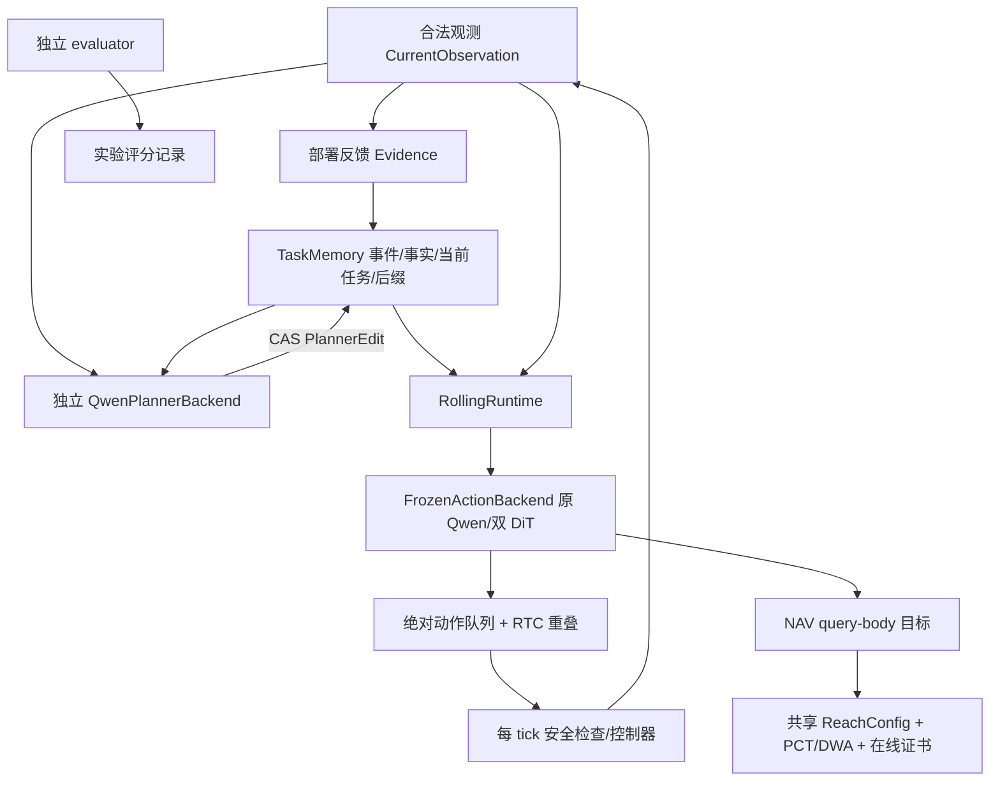

# VLA 框架修正交付与验证记录（2026-09-07）

状态：**代码与当前可执行验证已交付，等待用户审核；没有启动正式训练、新数据接入、采集或最终验收。**

本轮完整阅读 `docs/new_plan/01_collection_reconstruction_plan.md`（432 行）、`02_vla_staged_revision_validation.md`（447 行）、`03_developer_system_acceptance_theory.md`（906 行）。以文档二的分阶段架构为实施主线、文档三为合同与验收依据。本文只报告本轮实际实现和运行结果，不把设计规模当作完成数量。

## 1. 工作树、已有成果与变更边界

- 原参考 worktree：`ConveyorVLA-execution-validation`，`fix/grasp-evaluation-execution-v2@bf5d5ab1130cc4a91f9cf4396b275d3b52e1da31`。
- 新 worktree：同级 `ConveyorVLA-vla-revision`；独立分支 `feat/vla-rolling-rtc-20260907`。没有回退原分支、覆盖或 stash 原现场。
- 原 worktree 有 3 个已跟踪文件的修改和 13 个未跟踪文件，已复制到新 worktree，原件未改动。逐文件 SHA256 见 [继承状态](vla_revision_inherited_state_20260907.json)。这 16 个文件包含三份设计文档，以及导航/训练来源/共享前缀诊断；它们不是本轮重新实现的成果。
- 本轮新代码集中在 `src/conveyor_bench/conveyorvla/`、`scripts/`、`configs/vla_staged/`、两个新测试文件和本文。没有修改采集仓库、旧数据、normalizer 或权重。
- `.validation/` 已加入忽略规则，保存本轮测试 XML、开环结果和数值实验工件。模型、数据、逐帧日志均不进入 Git。代码留在新分支工作区供审查，没有推送或合并。

基线差异：原实现已有双 DiT、交替 cross/self attention、13D Mani 状态、源命令审计、三态接触评价、连续末段候选。因此本轮没有把这些重新命名为新增贡献。缺少的是持续任务/事实状态、版本化动作队列、采样内 RTC、新候选的独立模型/数据入口，以及共享导航到达与在线安全入口。

## 2. 修改后的架构与运行入口



`rolling_episode.run_rolling_episode` 是有界 episode 调度入口；观察、反馈、安全、控制与导航通过明确的适配器传入。它不读取 evaluator 真值。两个独立 worker 分别生成高层响应和低层动作；所有 memory/queue 提交在控制循环中执行。`realtime=False` 为暂停仿真的重叠诊断；`realtime=True` 可在等待 worker 时继续控制 tick，但真实时钟、推理长尾、GPU 调度和停车能力仍待物理验证。工作线程只属于本次 driver，不管理其他任务进程。

`FrozenActionBackend` 保留原 checkpoint 的图像顺序、13D 原 normalizer 和 canonical active-subtask 条件路径。新 JSON 计划不会被直接塞给旧动作 checkpoint。当前旧 canonical 条件只表示 cola/destination；换成不能表达的新目标身份时明确拒绝，避免声称旧模型已经理解新目标。旧 PLACE 的 retract 文本保留在冻结基线，新数据训练/条件缓存使用 **lower, release, and verify placement**。

`QwenPlannerBackend` 是独立高层服务的 prompt/结构化输出适配器，不是已训练好的 planner。所有 H0/H1/H2 必须绑定同一 `model_id` 的高层权重进行比较。可以使用单独适配后的 Qwen；本轮未对新 JSON 规划能力作真实性能声明。

### 关键模块

| 入口 | 实现与限制 |
|---|---|
| `contracts/action.py` | 三种秒级 profile、query-relative Mani 编解码/换锚点、query-body NAV 世界变换、完整 action identity |
| `contracts/observation.py` | 观测 allowlist、q/dq/gripper 与图像时间；eval-only 字段不进入模型对象 |
| `task_memory.py` | 原始指令、当前/剩余任务、完成事件、可撤销事实、来源与有效期、CAS、attempt ID |
| `rolling_planner.py` | H0 独立候选；H1 固定后缀；H2 局部修复；训练/推理共用 planner prompt |
| `action_queue.py` | 绝对目标、承诺区、晚到候选裁切、重复/乱序/失效身份拒绝、实际 apply 历史 |
| `rtc_sampling.py` | clean-action → velocity、最终估计 VJP、衰减重叠权重、指导强度、训练期 clean prefix/suffix loss |
| `dit.py` | 原参数名称/shape 保留；扩展 action-token time 及可选条件 bank，默认路径兼容旧权重 |
| `joint_trajectory_model.py` | `predict_actions(..., rtc_contexts=...)` 将 RTC 接入真实 Mani expert；NAV 不走 Mani RTC |
| `rolling_runtime.py` | request/response 生命周期、任务进度与队列衔接、限幅、原模型 backend、每 tick 安全回调 |
| `rolling_episode.py` | 有界同步/异步调度；队列为空、服务错误、VERIFY、FINISH、NAV 未准备均明确 hold |
| `rolling_isaac.py` | 现有Isaac simulation/action adapter绑定、真实capture时间、q/dq/底盘allowlist、50Hz apply/step、NAV保持与强制安全入口；已做fake-runtime接线回归，待物理验证 |
| `navigation_safety.py` | `ReachConfig`、稳定性状态机、保守反应/制动包络、`build_b0_navigation` 安全入口 |
| `staged_data.py` / `staged_training.py` | 新 raw/双视图读取、隔离、family split、独立 train-only normalizer、条件缓存身份 |
| `staged_experts.py` / `geometry_encoder.py` | NAV endpoint、25Hz Mani、训练 RTC、C0/C1、RGB-D、有界夹爪、FK 回调候选 |

### 任务与动作不变量

`last_model_output` 只记录模型回答；`last_completed_task_id` 只随受证据支持的完成事件更新。事实 false/unknown 或过期不会被历史完成事件重新置真。完成/FINISH 引用不存在、未来、其他 mission、已失效证据会被拒绝。FINISH 还需要最终任务与当前 `placed` 事实；FINISH 不改变 evaluator 的成功判定。

未来后缀编辑只增加 `plan_version`；替换当前任务、retry、当前前提失效会使旧动作失效。新尝试不能复用历史 task/attempt ID。动作 identity 包含 mission、instruction version、task epoch/ID、model、normalizer、安全上下文；编辑未来任务不会无谓清空当前队列。

动作队列按 **实际应用时间区间** 查找，不从新返回的第零点重放。承诺区不能由晚到预测追溯改写；安全中止可以清空承诺。未承诺重叠由 VJP 软指导生成，不做输出尾部硬复制，不按计时器强迫夹爪闭合。训练期 RTC 的已知干净前缀属于另一个需要训练的模型合同，不能与推理期 VJP 混称。

当前实现没有声称提供硬实时保证或已标定的自动事实估计器。适配器必须来自部署可获得的传感器/控制反馈；没有有效证据就保持 unknown/hold。新 planner、depth 编码器、token-time 使用和新位置 token 区间必须训练后再判定有效。

## 3. NAV 与安全修正

`ArmVLADWAControllerAdapter.bind_reach_config` 使用 dataclass replacement 创建本地 DWA 配置，把内层 `goal_tolerance` 绑定为外层的 0.12 m；不修改外部采集源码。外层 yaw 容差保持 0.14 rad，raw snap 门保持 0.10 m。

- 0.12–0.15 m 间隙：DWA 不再用另一个 0.15 m 正常停止条件。
- 位置内、yaw 外：返回 `validated_in_place_turn_required`，不把零命令当成到达，也不凭空生成没有扫掠证书的转向。
- 未到达时零命令：显式 `dwa_zero_control_before_reach`，要求重新查询/处理，不能默默计作完成。
- 重规划失败：先清除旧 active path，防止失败后继续消费旧路径。
- `build_b0_navigation`：强制在线证书；无证书即安全停止。共享稳定性默认候选值为线速度≤0.05 m/s、角速度≤0.10 rad/s、持续0.20 s；这些是待实测校准的研究配置，不是新增已认证安全阈值。
- `OnlineNavigationSafety` 检查当前完整转向包络、反应与停车保守覆盖。几何过期、速度超过已验证制动模型范围、包络越出可信区域都会拒绝动作。

证书要求完整机器人/当前携物包络、可通行支撑及制动参数的可靠身份，不能由普通 occupancy bool 自动声称获得。既有 `continuous_endpoint_candidate` 仍仅是候选；本轮没有批准它绕过 raw snap 门，没有把 B_raw 改写成 A，没有声称实测 C 已到达。

原构造入口仍可复现旧执行合同；采用 B0-runtime 安全合同必须通过 `build_b0_navigation`。现有旧 Isaac rollout CLI 没有被伪装为已验证的新 rolling rollout；新 driver 对应的 `IsaacRollingAdapter` 已实现并通过接口回归；camera_reader须返回真实传感器capture证据，feedback_estimator须提供合法估计。真实停车证书与物理验收仍须在资源明确后完成。使用既有已冻结物理profile的simulation/assistance wrapper初始化，不在新adapter中偷偷添加base lock或抓取约束；Mani保持零底盘命令，NAV保持进入该导航请求时的机械臂目标。

## 4. 独立候选与权重兼容边界

`configs/vla_staged/` 提供 10 个独立候选配置，均标为等待数据/训练；另有 P1 六组矩阵定义。

| 配置 | 相对共同候选只改变的因素 | 本轮状态 |
|---|---|---|
| `b0_learned.json` | 新可信 causal 5Hz 训练基线 | 实现/梯度 smoke；无新训练权重 |
| `nav_endpoint.json` | NAV 主输出 1×3，监督旧十点的末点 | 实现/梯度 smoke；实际到达待验证 |
| `mani_25hz.json` | Mani 50×7、0.04s；NAV 保持10×3、0.2s | 实现/梯度 smoke；2s 时域、0.4s 更新 |
| `training_rtc.json` | token-time 干净前缀与合法后缀损失 | 实现/梯度 smoke；不默认叠加推理 VJP |
| `bounded_gripper.json` | 仅 clean gripper 输出有界映射 | 实现/梯度 smoke；不声称物理抓取改善 |
| `fk_loss.json` | FK 辅助损失 | **回调接口和 toy 梯度**；真实可微标定 FK 未接入，真实 trainer 明确拒绝该候选 |
| `rgb_c0.json` / `rgb_c1.json` | 单 bank / 任务与 live bank 交替 cross-attention | 实现/梯度 smoke；相同 action backbone |
| `rgbd_c0.json` / `rgbd_c1.json` | 相同 depth encoder 分别接入上述耦合 | 实现/投影/梯度 smoke；待真实标定 depth |

C1 的具体初版是 successive cross blocks 交替访问 task/live bank；并非声称它必然优于 concat。C0 RGB-D 把 metric depth token 合入单一条件 bank，不使用伪彩 depth 冒充 RGB。两组用同一个编码器和固定 16 个 depth token。无效 depth token 的 valid mask 为 false，缺失值不作为零距离；task-only token 缓存不包含旧图像，live token 按当前 observation 重新计算。

旧 checkpoint 的所有原 tensor 名称/shape 不变。H=50 使用原大位置表中更长的 action 区间，shape 可 strict-load 不代表这些位置和 token-time 条件已训练。本轮没有静默 partial load。后续 legacy→candidate 初始化只 strict-load 两套原 action trunk，明确记录新增 geometry 参数为随机初始化、新时间/条件分布需适配；新训练另存 normalizer，旧权重始终绑定旧 normalizer。

## 5. 本轮实际测试与实验

小型可审计摘要见 [验证摘要 JSON](vla_revision_validation_20260907.json)。完整工件在新 worktree 的 `.validation/`，被 Git 忽略。

| 检查/实验 | 实际运行 | 结果与证据界限 |
|---|---|---|
| 全仓最终回归 | `pytest`，宿主机短时 localhost 权限 | **650 passed, 2 skipped**, 15.34s；1 个旧 pytest deprecation warning |
| 跳过项 | locomotion policy hash test；CUDA设备对齐test | 前者因发布worktree未安装该项外部policy权重；后者因最终回归显式禁用GPU。早先宿主机回归中CUDA对齐单测通过；没有因错误权重而跳过 |
| 首轮全仓回归 | 沙箱内 | 616 passed / 2 skipped / 2 failures；两失败均为 socket `Operation not permitted`，没有改测试绕过；宿主机单独复测2/2通过，最终全量通过 |
| 新 deterministic 合同测试 | 两个新测试文件，共46项（含参数化） | 计划/事实/完成、CAS、队列、VJP、token-time、数据时间/来源/family、depth/稳定/停车覆盖、候选梯度、driver 与 CLI |
| 原 checkpoint CPU 开环 | validation 索引4588/4784/4866/5130，4 route各1条、3 episode、seed17、batch1 | 4/4 route正确；NAV XY ADE 0.04310m、FDE 0.09530m；Mani raw joint MAE 0.05486rad、限制后0.03783rad；仅小样本诊断 |
| 开环原门 | 同一4样本 | predicted/oracle 裁剪事件率均 **0.192857**，原≤0.005门 **失败**；不据此部署 |
| 开环成本 | 原完整 Qwen+双 DiT，CPU BF16、2线程 | 527.74s（含该进程模型加载等）；不是GPU延迟或实时频率 |
| 原权重 strict-load / disabled regression | 真实最终 Mani 权重；独立加载 bf5d5ab 原版 DiT；同噪声 | 新默认采样与原版逐位一致；RTC gain=0逐位一致 |
| 原权重 VJP | 4/8步；**合成8-token VLM条件** | 输出有限、无参数梯度累积；CPU约0.973/1.980s；不是合法图像开环成绩或物理能力 |
| 原 normalizer/真实数据 | 8条旧 validation PICK 记录 | 最大往返误差2.22e-16；保留原身份，无重新拟合 |
| H0/H1/H2×L0/L1 | 6组，每组100个0.02s软件tick、5次请求 | 600软件tick闭环完成；tiny随机网络＋一阶关节测试模型；任务几何/strict成绩均null，不是600物理tick或6条物理任务 |
| 10候选架构 | `--mode candidates` | NAV/Mani loss、梯度和推理shape有限；随机tiny模型，不保存权重、不计真实能力 |
| 新读取CLI | pytest生成的明确 synthetic raw fixture | 时间/双视图/隔离清单生成成功；真实训练 normalizer 拒绝 synthetic；输出重用拒绝 |
| 新CLI入口 | 6个数据/缓存/训练/推理/runner入口（含planner训练）的`--help` | 入口可解析；真实新数据训练与完整缓存生成未运行 |

本轮测试中发现过一个 reset 反例错误消息先被缺tick错误覆盖的问题；已将跨reset检查前移，保留拒绝行为并使原因准确。没有通过弱化断言掩盖失败。

CUDA 状态：沙箱内 `nvidia-smi`/Torch不可见，宿主机只读检查确认4张H20、2/3号当时空闲。已一次性询问GPU分配和预算，未收到指定安排。正式模型开环因此使用CPU；早先宿主机全量回归通过既有的小型CUDA设备对齐单测；最终补齐adapter后的回归显式禁用GPU。**未启动GPU模型服务、Isaac物理rollout、大规模评估或训练。**没有继续轮询资源、另一台服务器或联系其他Agent。

### 分层结论

- **代码/合同**：上述已测试范围通过；不是整套ACC-01—24物理验收全部通过。
- **几何代理**：本轮未新增物理几何成功证据；原共享前缀/抓取代理结果只作为继承成果引用。
- **严格接触**：未新增传感覆盖验证，仍 unknown，不能转换为true或从分母删除。
- **完整任务成功**：本轮未新增完整transfer成功记录。没有把planner FINISH、软件driver结束或单元测试通过算成功。
- **部署门**：未通过；旧saturation门仍失败。

## 6. 新数据的实际读取合同

实现的模型侧规范文件：

```text
episode_<uuid>/
  manifest.json
  task.json
  observations.jsonl
  control_effective_50hz.jsonl
  task_events.jsonl
  images/...
  depth/...                    # 可选，必须有valid mask/标定
  evaluator_truth.jsonl        # 本读取器不读取
```

manifest 必需：`schema=raw-control-v2`、`action_contract=joint-command-v2`、`episode_uuid`、`task_family_id`、`source_commit`、`resolved_config_sha256`、`assets_sha256`、`assistance_profile`、`observation_contract=named-q6-dq6-gripper-rgb-v2`、`joint_names`、`joint_unit=rad`、`gripper_unit`。关节按名字映射为arm_joint1…6；不是按原数组位置猜测。

命令gripper支持明确的两种表示：`open_fraction` 时 `[g]`；`rad` 时两个关节目标并要求 `gripper_calibration.closed_joint_positions/open_joint_positions/pair_fraction_tolerance`，两侧经标定转换为一致的scalar开度。观测gripper为已标定的实测open_fraction。禁止按向量维度自行猜测单位。

每条观察必需：`mission_id/observation_id/time_s/q/dq/gripper`、四张 `images` 和 `image_times_s`、`base_xyyaw`、`primitive`、`active_task_id/active_task_epoch`。需派生的查询标 `action_query=true`。NAV还需可追溯的期望目标 `nav_goal_world_xyyaw/nav_goal_source_class`；**不从base_twist猜NAV目标，不把实测未来底盘运动伪装成新可信目标命令。**

每条control必需：文档三的`identity/clock/observation_ref/post_observation_ref/requested/resolved/intervention_refs`。`resolved.source_class`采用每通道map（arm_target/gripper_target/base_twist），取issued/held_valid/stale/unknown；held_valid必须引用同reset内已被物理消费的合法parent且目标一致。记录器仍是采集侧责任，本轮没有替采集端生成真实生效命令。

时钟严格检查：每个物理tick间隔0.02s、control_tick连续、wall monotonic严格递增、pre观察等于apply时刻、post为t+0.02。一个tick只有最终apply可推进物理；中间apply不重复成训练步。连续episode中再次reset拒绝。**整段真实未来区间**存在无效来源/干预/epoch跨越即隔离chunk，不只检查每10tick抽出的标签；不能用measured q、未来标签或缺失尾部padding补齐。

| profile | 第一个标签采样时刻 | 标签点数/间隔 | 队列应用时刻 |
|---|---|---|---|
| legacy_future_5hz | query+0.2s | 10×0.2s | first_apply显式记录，冻结基线首点立即开始保持 |
| causal_command_5hz | query | 10×0.2s | first_apply通常query，迟到结果跳过已过去区间 |
| causal_command_25hz | query | Mani50×0.04s；NAV仍10×0.2s | 同一2s执行覆盖、0.4s更新 |

图像历史保持0.2s；depth第一版只接受与当前观察同刻的已标定数据，异步深度配准是待验证接口扩展。depth字段包含`path/valid_path/capture_time_s/definition(z_depth或ray_range)/unit_scale/intrinsics/camera_to_base/calibration_id`。geometry encoder实现正确的两种反投影；K/T/单位的语义正确性仍需真实标定与投影对照，刚体矩阵合法不证明相机标定正确。

`task.json` 含原始指令和初始Task列表；`task_events.jsonl` 的query记录含 observation_id、历史合法feedback/edit、当前feedback及label。读取器重放TaskMemory构造因果输入，label经同一编辑协议验证。teacher/evaluator可帮助离线标注，但不进入普通planner输入。高层CE没有使用无标签progress头或行号作为完成监督。

family split 显式由 episode UUID→train/validation/test 映射提供，同family不能跨split。Normalizer由非synthetic、可信train的共同NAV/Mani池拟合，单独ID；不能替换原checkpoint normalizer。字段详情和最小合成格式可直接阅读 `tests/test_staged_data_experts.py::fixture`；该fixture绝不是采集示范。

## 7. 可执行检查、训练准备与推理步骤

以下在新worktree根目录运行。已存在环境：

```bash
export VLA_PY="$PWD/artifacts/.conda-envs/conveyorvla-al0-lerobot044/bin/python"
export OMP_NUM_THREADS=2
export PYTHONDONTWRITEBYTECODE=1
```

无需新数据、不会保存模型的检查：

```bash
PYTEST_DISABLE_PLUGIN_AUTOLOAD=1 "$VLA_PY" -m pytest -p no:cacheprovider \
  tests/test_rolling_rtc.py tests/test_staged_data_experts.py
"$VLA_PY" scripts/train_staged_vla.py --config configs/vla_staged/mani_25hz.json --smoke
"$VLA_PY" scripts/run_staged_experiments.py --mode mechanism --output .validation/review-mechanism
"$VLA_PY" scripts/run_staged_experiments.py --mode candidates --output .validation/review-candidates
```

所有输出目录必须全新，重复运行请换目录，不覆盖本轮工件。完整pytest中的localhost测试需要沙箱允许创建本机socket；不要删测试或降级断言。

原模型可复核命令（本轮实际已执行，CPU约9分钟）：

```bash
"$VLA_PY" scripts/evaluate_joint_trajectory_formal.py \
  --checkpoint ../training_runs/conveyorvla-abot-m0-liangzhunew500-5hz-formal-20260905-r1/checkpoints/step_002414 \
  --config configs/manipulation_navi_v1.json --split val --batch-size 1 --max-rows 4 \
  --device cpu --output-dir .validation/review-open-loop
"$VLA_PY" scripts/run_staged_experiments.py --mode checkpoint \
  --checkpoint ../training_runs/conveyorvla-abot-m0-liangzhunew500-5hz-formal-20260905-r1/checkpoints/step_002414 \
  --output .validation/review-checkpoint-numerics
```

**以下是审核后、新数据到达后的操作，不是已执行记录。数据出现不会自动触发任何命令。**先设置对应真实路径；不要用本轮synthetic fixture代替。

```bash
"$VLA_PY" scripts/prepare_staged_data.py \
  --episodes "$RAW_EPISODE_A" "$RAW_EPISODE_B" \
  --split-manifest "$FAMILY_SPLITS" --profile causal_command_5hz \
  --fit-normalizer --output "$NEW_RELEASE"
"$VLA_PY" scripts/cache_staged_conditions.py \
  --release "$NEW_RELEASE" --checkpoint "$BASELINE_CHECKPOINT" \
  --output "$NEW_CONDITION_CACHE" --device "$REVIEWED_DEVICE"
"$VLA_PY" scripts/train_staged_vla.py \
  --release "$NEW_RELEASE" --condition-cache "$NEW_CONDITION_CACHE" \
  --encoder-model-id "$ENCODER_WEIGHTS_SHA256" \
  --legacy-checkpoint "$BASELINE_CHECKPOINT" --config configs/vla_staged/b0_learned.json
"$VLA_PY" scripts/train_staged_planner.py \
  --release "$NEW_RELEASE" --checkpoint "$BASELINE_CHECKPOINT"
```

两条train命令**默认只preflight**。正式运行需审核后显式增加 `--execute --output <全新且在worktree外的路径> --device <已分配设备>`；本轮没有执行。action trainer固定冻结Qwen条件缓存，NAV/Mani各占effective batch一半；配置示例1000steps、batch64只是待审核预算，**不是冻结的新正式recipe或收敛结论**。尚未实现真实事件加权采样和后续共享Qwen阶段解冻runner，采用前需审查任务/事件预算。planner trainer以因果H2 task view适配一个独立φP；H0/H1/H2复用同一适配模型，不能各训一套后冒称结构消融。

新模型离线推理命令：

```bash
"$VLA_PY" scripts/infer_staged_vla.py \
  --checkpoint "$TRAINED_CANDIDATE/model.pt" --condition "$CURRENT_CONDITION_FILE" \
  --record "$CURRENT_OBSERVATION_METADATA" --output "$NEW_PROPOSAL_JSON" --device "$REVIEWED_DEVICE"
```

输出为proposal，仍需统一decode/limits/epoch/queue/safety。`--prefix`仅供已训练token-time候选，输入必须已按当前query/time/任务对齐。原冻结模型通过 `FrozenActionBackend` 接入 `RollingRuntime`；完整调度用 `run_rolling_episode`，可使用 `IsaacRollingAdapter.observe/apply/hold/navigation` 提供现有Isaac I/O；仍须传入合法feedback_estimator、每tick Mani安全回调和`build_b0_navigation`构造的NAV适配。当前没有声称提供经过物理验证的开箱即用新Isaac launch CLI。

## 8. 未解决项、实验顺序和待批准事项

**等待新数据/训练**：真实raw-control-v2合同pilot、可信joint监督、新planner语义适配、H0/H1/H2真实性能、25Hz/token-time/depth/C1/endpoint/FK等真实训练和对应权重。新模块随机初始化或strict-load能通过不等于已有效。

**等待资源与物理验证**：新driver及已实现Isaac观察/控制适配的物理验证、共享到达配置的源NAV实际执行、在线停车模型/完整携物包络证书、VJP真实RGB条件下的小规模D分叉、完整任务、高层故障恢复、真正异步推理。无新增严格接触校准。GPU分配已问一次，未自行安排2/3号卡上的服务或仿真。

**仅完成接口/阶段入口**：真实可微FK回调；depth真实标定/退化数据；共享VLM迁移和分阶段解冻；自动事实估计器的传感器适配/标定。普通planner严禁用评价真值补齐这些空缺。

建议审核后的顺序：

1. 审核本轮代码、schema、继承文件边界、candidate定义及冻结权重兼容证据。确定GPU与仿真额度。
2. P0：单卡小型源NAV停止/到达/停车回放；先取得可信实际C，保留A/B_raw/B_exec/C和原门。新数据到达后先合同pilot、读取/来源/时钟与split检查，**仍不自动训练**。
3. P1：固定低层和同一高层φP，从已知000006/24/30机制反例及真正RTC D分支开始；再扩H0/H1/H2×L0/L1。先运行10条量墙钟；240次设计初筛需另批预算，不能把本轮6组软件测试计入。
4. P2：可信D-normal/D-task，同初始化、共同normalizer、固定steps/effective batch/事件预算。先冻结Qwen条件，验证训练入口后单seed筛选。
5. P3/P4：NAV endpoint、Mani分辨率、两类RTC、有界夹爪、FK分别试验；再进行RGB/RGB-D×C0/C1，禁止默认全叠加。真实深度缺失/扰动与成本同时报告。
6. P5/P6：实际handoff与共享VLM迁移另立协议；方法确有完整任务收益后才讨论三训练seed、最终100family/600或1800rollout。

资源预算建议（DESIGN，不是本轮使用承诺）：先批准一张空闲H20，给低层服务与至多2个短仿真诊断的30–60分钟窗口；双Qwen原型先测实际显存，不能只按一个VLM报账。先10条计时后再估算240次；训练配置的1000×64先不执行，需根据新数据唯一episode数、有效动作点、事件分布与cache存储实测审核。正式重训、多seed与最终验收不在本轮授权内。

## 9. 算法来源与证据身份

RTC官方实现核对并锁定为 [9296f31d62d5bfeb5779dcb2f9bcf71ca37f448b/src/model.py](https://github.com/Physical-Intelligence/real-time-chunking-kinetix/blob/9296f31d62d5bfeb5779dcb2f9bcf71ca37f448b/src/model.py)，采用其重叠权重及VJP指导关系，按本项目clean-action/采样时钟实现PyTorch适配。MIT归属与许可保留在 [rtc_MIT.txt](third_party/rtc_MIT.txt)。没有运行或宣称复现官方Kinetix物理实验。任务级rolling plan、CAS、双版本、数据隔离与停车证书组织是本项目工程实现，不冒称原RTC的离散任务算法。

最终权重SHA256：`d86360e96d97f45467281ca77a006eba85c085c737e4156170efbf8a58a351b9`。
原normalizer ID：`joint-trajectory-normalizer:44ee9d21bfd916587c23161e`。
各次实验自身source identity、选择样本、参数与指标保留在`.validation`原报告；后续代码修正不会追溯改写早先实验的源码身份。最终pytest XML另保存最后代码状态的回归结果。
