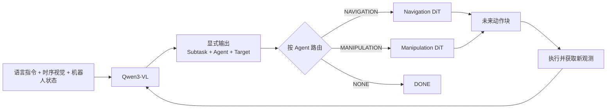

# ConveyorVLA AL0：VLM 自主路由的双 DiT 模型方案

> 已被取代的提案：本文包含 state token、单次 Qwen 编码和 direct-action DiT 等未获最终
> 采用的设计。现行实现必须遵循
> [Waypoint Policy v1](conveyorvla_waypoint_policy_contract_v1.md)；本文只保留为设计
> 演化记录。

## 1 模型目标与边界

给定完整指令：

> 走到有可乐的箱子前，拿起可乐，原地向后转，到空箱子前，把可乐放到箱子上。

模型需要在闭环过程中自主回答两个问题：

1. 当前语义子任务是什么；
2. 当前应调用导航专家还是操作专家。

四个语义子任务与两个动作专家的关系如下。

| VLM 输出的 `subtask` | VLM 输出的 `agent` | 当前目标 | 调用的动作模型 |
|---|---|---|---|
| `NAV_TO_SOURCE` | `NAVIGATION` | 有可乐的源区域 | Navigation DiT |
| `PICK` | `MANIPULATION` | 可乐物体 | Manipulation DiT |
| `NAV_TO_TARGET` | `NAVIGATION` | 空的目标箱 | Navigation DiT |
| `PLACE` | `MANIPULATION` | 目标箱内的放置区域 | Manipulation DiT |
| `DONE` | `NONE` | 无 | 不调用 DiT |

这里的四个 `subtask` 描述任务语义，两个 `agent` 描述动作空间。两者不能混为一个标签：`NAV_TO_SOURCE` 和 `NAV_TO_TARGET` 使用同一个导航动作域，但语言目标和视觉目标不同；`PICK` 和 `PLACE` 使用同一个操作动作域，但末端行为不同。

## 2 总体架构



架构中只有 VLM 负责语义决策。Dispatcher 是一个确定性的接口映射器：收到 `NAVIGATION` 就调用 Navigation DiT，收到 `MANIPULATION` 就调用 Manipulation DiT。它不包含任务顺序表，也不自行修改 VLM 的决策。

## 3 VLM 的显式输出

### 模型内部输出格式

应在 Qwen3-VL 的词表中加入少量受约束任务 Token，并按固定语法解码：

```text
<SUBTASK_PICK> <AGENT_MANIPULATION> <TARGET_SOURCE_OBJECT>
```

建议的 Token 集合为：

```text
Subtask:
  <SUBTASK_NAV_TO_SOURCE>
  <SUBTASK_PICK>
  <SUBTASK_NAV_TO_TARGET>
  <SUBTASK_PLACE>
  <SUBTASK_DONE>

Agent:
  <AGENT_NAVIGATION>
  <AGENT_MANIPULATION>
  <AGENT_NONE>

Target:
  <TARGET_SOURCE_REGION>
  <TARGET_SOURCE_OBJECT>
  <TARGET_TARGET_REGION>
  <TARGET_TARGET_CONTAINER>
  <TARGET_NONE>
```


### 对外可观察接口

模型原始 Token 在日志和推理接口中序列化为结构化结果：

```json
{
  "subtask": "PICK",
  "agent": "MANIPULATION",
  "target": "SOURCE_OBJECT",
  "confidence": 0.94
}
```

其中 `confidence` 由相应 Token 的归一化概率计算，不要求模型额外生成一个数值字符串。该结果必须与动作块一起写入 rollout，便于分析“VLM 选错任务”还是“DiT 动作执行失败”。


## 4 从单一隐藏向量改为多 Token 条件

旧设计将 Qwen3-VL 最后一层的单个 hidden state 直接送入动作模型。这种做法会把任务语义、目标语义和视觉运动信息压缩到同一个向量中，不利于分析和路由。

新设计保留下列条件特征：

- `subtask token hidden state`：表示当前技能语义；
- `agent token hidden state`：表示当前动作域；
- `target token hidden state`：表示当前视觉目标；
- 时序视觉摘要 Token：表示物体和机器人在短时间内的运动；
- 28 维状态投影：同时供 VLM 决策和 DiT 动作预测使用。

这些特征经过专家各自的条件投影器后送入 DiT。这样既保留 Qwen3-VL 的 2560 维语言视觉表征，也避免依赖一个含义不明确的末位向量。

## 5 双 DiT 动作专家

### 5.1Navigation DiT

Navigation DiT 只预测底盘动作：

\[
\hat{A}^{nav}_{t:t+H-1}
= D_{nav}(H_t, s_t, e(z_t), e(q_t))
\]

其中默认动作时域 (H=20)，每一步输出：

\[
a^{nav}_t = [v_x, \omega_z]
\]

`NAV_TO_SOURCE` 与 `NAV_TO_TARGET` 共用 Navigation DiT，但使用不同的 `subtask` 与 `target` 条件。因此模型可以共享行走和转向能力，同时学习不同的语义目的地。

### 5.2 Manipulation DiT

Manipulation DiT 只预测末端执行器与夹爪动作：

\[
\hat{A}^{manip}_{t:t+H-1}
= D_{manip}(H_t, s_t, e(z_t), e(q_t))
\]

每一步输出：

\[
a^{manip}_t =
[\Delta x, \Delta y, \Delta z,
\Delta r, \Delta p, \Delta \psi, g]
\]

`PICK` 与 `PLACE` 共用 Manipulation DiT，但通过不同任务 Token 学习抓取、抬升、收回、下降和释放等不同动作模式。


## 6 训练监督设计

### 每个训练样本需要的字段

每个时间窗口至少包含：

```text
global_instruction
head_temporal_observation
wrist_temporal_observation
robot_state_28d
previous_subtask
previous_agent
subtask_label
agent_label
target_label
domain_action_chunk
episode_id
```

动作块不能跨越子任务边界。边界附近的样本应截断或在下一个子任务重新取窗，否则一个 DiT 会同时收到两个动作域或两个技能阶段的监督。


## 7 损失函数

VLM 任务决策损失为：

\[
\mathcal{L}_{plan}
= \lambda_z \mathcal{L}_{subtask}
+ \lambda_a \mathcal{L}_{agent}
+ \lambda_q \mathcal{L}_{target}
+ \lambda_c \mathcal{L}_{consistency}
\]

其中前三项为受约束任务 Token 的交叉熵，`consistency` 用于约束同一次输出中的 `subtask-agent-target` 组合一致。

两个 DiT 分别计算扩散动作损失：

\[
\mathcal{L}_{nav}
= \mathbb{E}_{a_t=\mathrm{NAVIGATION}}
[\mathcal{L}_{diff}(\hat A^{nav}, A^{nav})]
\]

\[
\mathcal{L}_{manip}
= \mathbb{E}_{a_t=\mathrm{MANIPULATION}}
[\mathcal{L}_{diff}(\hat A^{manip}, A^{manip})]
\]

总损失为：

\[
\mathcal{L}
= \mathcal{L}_{plan}
+ \lambda_n \mathcal{L}_{nav}
+ \lambda_m \mathcal{L}_{manip}
\]

训练初期按真实 `agent_label` 路由动作损失，避免 VLM 尚未收敛时把样本送入错误专家；后期再逐步使用 VLM 预测路由，以缩小训练与闭环推理之间的差异。


## 8 训练步骤

### A 训练 VLM 任务决策能力

- 保留 Qwen3-VL 的预训练视觉语言能力；
- 训练任务 Token、28 维状态投影和时序适配器；
- 对 Qwen3-VL 上层 Transformer 使用 LoRA，而不是永久冻结整个 VLM；
- 只优化 `subtask-agent-target` 的结构化输出。

完全冻结 VLM、只在外部增加一个 MLP 分类器，虽然实现简单，但本质上仍是“VLM 特征 + 外部 Router”，不符合由 VLM 自身形成并输出子代理决策的目标。

### B 分别训练两个 DiT

- 使用真实 `agent_label` 选择动作专家；
- Navigation DiT 只读取导航动作样本；
- Manipulation DiT 只读取操作动作样本；
- 两个专家使用独立的动作归一化统计和验证指标；
- VLM 输出的任务与目标隐藏 Token 作为动作条件。

### C 联合适配

- 在一部分 batch 中使用预测的任务 Token 作为 DiT 条件；
- 逐步提高预测路由比例；
- 以较小学习率联合调整 VLM 的 LoRA、条件投影器与两个 DiT；
- 分别记录规划错误和动作错误，避免只用一个总 loss 掩盖失败来源。

### 阶段 D：无辅助闭环评测

- 每个重规划周期由 VLM 自主输出结构化决策；
- Dispatcher 只调用一个对应 DiT；
- 执行动作块前部后重新观测和规划；
- 全程保存任务 Token、置信度、专家名和动作块。

## 9 推理接口

一次模型推理的最小输出为：

```python
PolicyOutput(
    subtask="PICK",
    agent="MANIPULATION",
    target="SOURCE_OBJECT",
    confidence=0.94,
    action_chunk=Tensor(shape=(20, 7)),
)
```

推理过程为：

1. Qwen3-VL 对完整指令、两路时序视觉、状态 Token 和任务记忆进行一次编码；
2. 受约束解码器生成当前任务 Token；
3. Dispatcher 根据 `agent` 选择唯一的 DiT；
4. 选中的 DiT 复用同一次 VLM 前向得到的条件特征并生成动作块；
5. 执行若干步后，用新观测重新运行上述过程。
